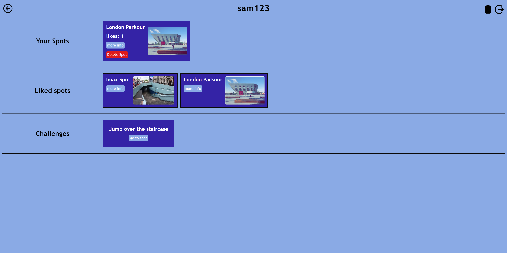

# Free Train

#### This project is like instagram for parkour, users can upload and view training locations.

#### Users have the ability to add locations and upload pictures for others to view.

#### They can save their locations using the like feature and are able to share challenges for others to complete.

## Getting started

1. This app requires a connection to mongo db. You must either install it or add an online connection. Once completed change the link in the db.js file
2. run npm i in the server folder then run nodemon index.js
3. run npm i in the client folder and then run npm run dev

## tech stack

### front end

- React (front end framework)
- Redux (state management)
- Leaflet and react Leaflet (maps)
- axios (server requests)
- setup .env with VITE_CLOUDINARYNAME variable in the client folder. This variable should be your Cloud name from cloudinary. Either signup or go to your dashboard to find the name. You will also need to ensure it is set to an unsigned url. Go to settings and the Upload area. Enable unsigned uploading. Click upload preset and add a new upload preset called 'default' ensuring that the signing mode has been turned to unsigned.
- To test with cypress run 'npm run cypress:open and follow the instructions.
- To test with vitest run 'npm run test'

### back end

- Express (general framework)
- Express file upload (file upload)
- Express session (authentication)
- mongoose and mongoDB (database and access)
- Bcrypt (password hashing)
- Set the test script if on mac to: "ENV=test mocha './dist/test/server.test.js'" and on Windows: "ENV=test && mocha './dist/test/server.test.js'". Also ensure you have uploads folders on both
